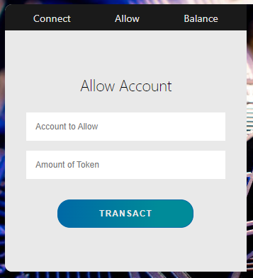

[](https://classroom.github.com/online_ide?assignment_repo_id=9029421&assignment_repo_type=AssignmentRepo)

# Exchange - Token fungibles

## **Índice**

[**Descripción del Proyecto y sus Componentes**](#DescripciónProyecto)

[**Estructura del Repositorio**](#EstructuraRepositorio)

[**Setup**](#Setup)

[**Diagrama de interacción entre cuentas**](#DiagramaInteraccion)

[**Test**](#Test)

[**Deploy**](#Deploy)

[**Frontend**](#Frontend)

[**Lecciones aprendidas**](#LeccionesAprendidas)

[**Errores conocidos**](#ErroresConocidos)

[**Integrantes del equipo**](#Integrantes)

[**Video**](#Video)


<div id='DescripciónProyecto' />

## Descripción del Proyecto y sus Componentes

El proyecto busca crear un ecosistema financiero basado en blockchain, donde los usuarios puedan comprar y vender tokens fungibles a cambio de ethers. Para esto se crearon dos contratos inteligentes.

El primer contrato inteligente es un token fungible que sigue el estándar ERC-20. El segundo es un Exchange que permite la compra y venta de tokens fungibles. Es este el contrato que se utiliza en el frontend. Estos contratos están en la carpeta contracts, en donde también se encuentra la interfaz del contrato ERC20, de nombre IERC20, que permite la llamada de este de parte del Exchange.

Estos contratos además tienen tests en la carpeta test, que permiten asegurarnos que los métodos de los contratos funcionen correctamente antes de hacer el deploy de los mismos en la red.

El deploy se hace desde el archivo deploy.js que se encuentra en la carpeta scripts.

Por último está la carpeta app que es donde se encuentra toda la lógica del frontend. El frontend permite conectar una cuenta de MetaMask con el contrato de Exchange y ejecutar la operación de comprar un token. Además se puede ver el balance de la cuenta conectada. Estas dos cosas nos permiten ver que el exchange funciona de manera correcta ya que al comprar un token debería bajar el balance de ethers de la cuenta. La carpeta del frontend tiene 4 subcarpetas que separan toda la lógica del frontend entre el css, el html y el js.


<div id='EstructuraRepositorio' />

## Estructura del Repositorio

Decidimos estructurar el repositorio siguiendo Git Flow, tendremos una branch develop donde iremos sumando las nuevas funcionalidades una vez fueron establecidas, e iremos creando nuevas branches para ir sumando cada nueva feature para el proyecto. Estas nuevas branches tienen el nombre de "feature/' más el nombre de la feature a trabajar.

Además para hacer merge entre una feature y develop se debe primero crear un Pull Request en GitHub para que lo mire otro miembro del equipo y si considera que todo está bien y no hay conflictos se hace el merge. Esto nos asegura una mayor calidad de código, mas familiaridad con el código y menos conflictos imprevistos. 

Una vez obtenido un MVP vamos a proceder a enviarlo a main.


<div id='Setup' />

## Setup

Lo primero que se debe hacer es clonar el repositorio. Luego se deben ingresar los siguientes dos comandos en la consola:

- Primero debemos instalar hardhat, el comando es el siguiente: `npm install hardhat --save-dev`.

- Y luego debemos instalar las dependencias con el siguiente comando: `npm install`.

Para poder correr el frontend, debemos tener instalado NodeJS en el equipo, y la billetera MetaMask en el navegador.

El front se corre de la siguiente forma:

- En la consola, situado en la raíz del proyecto, se ejecuta: `node app/index.js`

- Nos indicará que la aplicación está en ejecución y que accedamos por el navegador al puerto 3000 en localhost.


<div id='DiagramaInteraccion' />

## Diagrama de interacción entre cuentas

Pasaremos a diagramas las 4 cuentas básicas del proyecto y su integración final, posteriormente en la sección de Tests explicaremos cómo llegamos al presente diagrama:


<div id='Test' />

## Test


### Descripción y justificación de las pruebas

En la presente sección vamos a ir explicando el transcurso de las pruebas y la relación entre las cuentas involucradas, armando de forma paulatina de esta forma el diagrama de interacción de las cuentas.

Comenzaremos con la cuenta signer, que será la del owner de ambos contratos.

Desde esa cuenta se hace el deploy del contrato ERC20.

En este momento tenemos dos cuentas, la del Signer y el Contrato ERC20.


Comienzan las pruebas del contrato y se prueba tanto que los errores que deban saltar sean los correctos, como que se puedan realizar correctamente las acciones y se emitan los eventos correctos.

Al finalizar tendremos el siguiente balance de tokens y autorizaciones entre cuentas.

| Cuenta | Tokens | Approve |
|--------|--------|---------|
| Signer | 900 | Account1 +20 |
| Contrato ERC20 | 0 | |
| Account1 | 0 | |
| Account2 | 100 | |

Hasta aquí surgieron otras dos cuentas que por ahora no tienen importancia en el diagrama, son sólo cuentas que interactúan con el contrato.

Es importante conocer los balances y aprobaciones finales, porque nos resultan útiles para desarrollar las pruebas futuras.

Ahora vamos a comenzar a probar el contrato del exchange, por lo que empezarán a ser tomados en cuenta además los ethers, que hasta ahora no eran relevantes. Las cuentas en el ambiente de pruebas de solidity cuentan con 1000 eth. Nosotros para deployar el contrato y probarlo lo haremos con 20.

Antes de realizar el deploy, debemos analizar un par de situaciones, se debe seleccionar una cuenta para que sea el tokenVault, dicha cuenta debe poseer ya tokens en su balance, por lo que seleccionaremos a Account2 para ser la misma.

Además, tenemos que tener en cuenta de que en el constructor del contrato debemos transferir la cantidad solicitada de tokens desde la cuenta del owner a la del tokenVault, por lo que necesitaremos una aprobación previa para realizarlo. Este fue un punto en donde el equipo tuvo que analizar cómo encontrar el address de un contrato no deployado aún, lo que fue solucionado con una función de la librería `@ethersproject`, `getContractAddress()`. En la misma tomamos la dirección de quién va a realizar el deploy y con la cantidad de transacciones realizadas podemos calcular el address del siguiente contrato a deployar.

```js
const transactionCount = await signer.getTransactionCount();
 
const futureAddress = await getContractAddress({
    from: signer.address,
    nonce: (transactionCount + 1)
});

const tx = await contractInstanceERC20.approve(futureAddress, tokenAmount);
```

Le agregamos uno al número de transacción para que nos cuente además la transacción del approve.

Ahora, entran en cuenta las otras dos addresses relevantes, y nos quedará el siguiente diagrama.


Para comenzar con las pruebas del exchange, primero le damos el approve al Exchange para que utilice 100 Tokens del Signer. Luego se realiza el deploy y la lista de variables importantes nos queda de la siguiente forma:

| Cuenta | ETH | Tokens | Approve |
|--------|--------|----|-----|
| Signer | 980 | 800 | |
| Token Vault (Account2) | 1000 (no relevantes) | 200 | Exchange 200 |
| Contrato ERC20 | 0 | 0 | |
| Exchange | 20 | 0 | |

Variables:

- Invariante: 20 * 200 = 4000 ether<sup>2</sup>
- FeePercentage: 3% = 3 ether / 100

En esta parte nos surgieron dos dificultades, la de tener un porcentaje expresado en ethers y la de que no existen fracciones ni números negativos en solidity, lo que conlleva a tener un cuidado especial sobre operaciones comunes con números de esta magnitud, como ser la división entre un divisor mayor (da siempre 0) o la resta de un número mayor (nos lanza error de underflow y overflow).

En las pruebas tuvimos que tener en cuenta un error de aproximación, resultado entre la diferencia de hacer las operaciones en JavaScript y solidity, y costos de gas, por lo que varias veces utilizamos el método approximately para verificar los nuevos montos.

```js
expect(amount).to.be.approximately(expectedAmount, 0.00000000000002);
```

Para las pruebas del seteo del porcentaje de fees, ampliamos el mismo al 100% para poder luego hacer un extracción de los ethers recolectados, para lo mismo debemos setearlo en 1 ether, así mantenemos las cifras necesarias para operar.

### Ejecución de las pruebas
La ejecución de los tests se hace con el siguiente comando en la consola: `npx hardhat test`.

### Cobertura de las pruebas
Tuvimos al final un porcentaje de cobertura de pruebas del 100%.


Dejamos en el repositorio los reportes generados por la herramienta, en el directorio coverage.


<div id='Deploy' />

## Deploy

El deploy del contrato se realiza a través de un único script mediante el comando: `npx hardhat run scripts/deploy.js --network goerli`.

El mismo toma los datos del archivo .env y deploya los contratos en la testnet de Goerli. 

Las acciones que realiza para deployar ambos contratos son similares a las ejecutadas en los test para realizar la misma tarea en nuestra red de prueba:

1. Deploya el ERC20.
1. Verifica el address del futuro contrato.
1. El signer autoriza al nuevo contrato (el Exchange) a controlar sus tokens.
1. Deploya el Exchange.

Para finalizar muestra por pantalla las direcciones de los nuevos contratos.

### Address de los contratos deployados

ERC20_CONTRACT_ADDRESS = 0xDf1bB6f75d6Afb6F5a573a026E6C0Ab92BB3ff32

EXCHANGE_CONTRACT_ADDRESS = 0xCE6A7eCEf26f43eD07A0e1F34EA132C4F797411D


<div id='Frontend' />

## Frontend

En el frontend implementamos todas las funcionalidades que un usuario podría querer realizar y mostramos información útil para que puedan interactuar con los contratos. Los usuarios podrán entonces realizar operaciones tanto con el ERC20 como con el Exchange, y de esa forma categorizamos el frontend. 
Nuestra aplicación tal como es esperado conecta con la wallet de Metamask, es por eso que si el usuario no inició sesión aún, se va a desplegar la pantalla de metamask para permitirle así interactuar con la aplicación.

### ERC20


Como se muestra en la pantalla a continuación, al interactuar con el contrato erc20, podemos en principio, desde la pestaña <i>Connect</i> ver un resumen de datos del usuario conectado, como su account y su balance. Adicionalmente podemos desde la pestaña <i>Allow</i> darle permisos a otra cuenta para que opere en nombre nuestro sobre un monto de tokens seleccionado. Y por último en la pestaña <i>Balance</i>, podemos consultar el balance de otras cuentas para las que conozcamos su address.

| Connect | Allow | Balance
|---------------------------|---|-----------
|  |  | 


### Exchange


Como se muestra en la pantalla a continuación, al interactuar con el contrato Exchange, podemos en principio, desde la pestaña <i>Data</i> ver un resumen de datos del contrato, como la tasa, el balance y otros datos de interés para el usuario. Luego desde la pestaña <i>Buy Token</i> es que podemos hacer la compra de tokens, para ello debemos ingresar la cantidad que se quiere comprar y los ether que vamos a destinar. Siguiendo con el funcionamiento, en la pestaña <i>Rate</i>, podemos consultar la tasa que se va a solicitar para la compra deseada. Y por último en la pestaña <i>But ETH</i> podemos ingresar la cantidad de tokens que queremos vender.

| Data | Buy Token | Rate | Buy ETH
| -- | -- | -- | --
|  |  |  | 


Para terminar, implementamos una funcionalidad que nos informa que las operaciones en la blockchain fueron iniciadas y posteriormente nos avisa cuando finalizaron correctamente. Estos mensajes se muestran en la esquina superior derecha de la aplicación, tal como se muestran en las imágenes que siguen

| Caso de error | Transacción aprobada | Transacción iniciada | Transacción completada
|--|--|-- | --
|  |  |  | 

De este modo incrementamos la experiencia de usuario manteniéndolo informado en todo momento sobre las operaciones y las respuestas de la blockchain. Mejorando así la experiencia de usuario.


<div id='LeccionesAprendidas' />

## Lecciones aprendidas

En el transcurso del obligatorio aprendimos "por la fuerza", las singularidades que presenta el programar en Solidity, como ser la forma de manejar las operaciones aritméticas, que si el divisor es mayor la división da cero, si la resta va a dar negativo lanza error, entre otras.

También que cuando se envía Ethers en un método, ya estos pasan a formar parte del balance del contrato. 

Controlar cifras muy grandes, que después dan problemas en las verificaciones de los tests, o bien el gas empleado en realizar las transacciones.

Para superar estas nuevas dificultades, nos tuvimos que valer de múltiples herramientas, como ser las clásicas plantillas de Excel, o tener que deployar los contratos en Remix, e ir probando las operaciones para ver cómo se van comportando los contratos y variando sus argumentos.

Pero lo que más nos ayudó a entender el funcionamiento y cómo interactúan los contratos en la red de Ethereum fueron los tests. Al realizarlos no tuvimos posibilidad de escapar de tener un profundo conocimiento de nuestro código, y llegamos a encontrar errores en el otro contrato que no nos permitía operar como se debía. Un ejemplo de ello fue probando realizar la venta de tokens desde una cuenta sin autorización, verificamos que el método no funcionaba, esto era porque no habíamos realizado en el contrato ERC20 la resta de los tokens que va moviendo el contrato, por lo que para solucionar el problema hicimos un test que lo comprobara, lo hicimos pasar y luego seguimos con el trabajo.


Aprendimos a trabajar como equipo, creando diferentes ramas en el repositorio para no pisar nuestro trabajo. Teniendo situaciones en las que el trabajo no salía y cambiábamos de tareas para poder destrabarnos. A continuación dejamos constancia de aporte de los diferentes integrantes en el repositorio.

| Evidencia de ramas| Aportes Iara | Aporte Juan Martín | Aportes Federico
| -- | -- | -- | --
| |  |  | 

Para finalizar, pudimos deployar ambos contratos en la testnet de Ethereum, interactuar con ellos y también importar el token creado en la billetera MetaMask. Tuvimos la oportunidad de crear una interfaz web y poder llevar a cabo en un ambiente real, las operaciones que realizábamos en los tests, lo que tomamos como una meta personal cumplida.


<div id='ErroresConocidos' />

## Errores conocidos

A continuación remarcaremos los errores que encontramos en nuestro trabajo y por temas de tiempo no pudimos solucionarlos:

- Luego del deploy de los contratos, tenemos que ingresar a la cuenta del Vault para autorizar al Exchange sobre sus tokens. No encontramos cómo cambiar la instancia del signer en el archivo de deploy a partir de la dirección.

- En la interfaz web no controlamos el manejo de errores de forma correcta, simplemente los imprimimos por consola. Buscamos mejorar otros aspectos y sumar funcionalidades en lugar de una mejor usabilidad de la aplicación.

- En la interfaz web no controlamos los inputs, suponemos que el usuario debe ingresarlos de forma correcta, de lo contrario se realizará una transacción para que falle en el Exchange.

- Existen métodos que utilizan muchas variables dentro, sobre todo los de exchange de tokens o ethers, que a su vez calculan el fee, encontramos difícil de debuggear los problemas cuando los implementábamos de forma compacta. 

Se agregaron los errores como issues al repositorio para tener un mejor seguimiento.


<div id='Integrantes' />

## Integrantes del equipo

### ESTUDIANTE 1

NUMERO DE ESTUDIANTE: 191748

NOMBRE DE ESTUDIANTE: Iara Pintos

ADDRESS DE SU CUENTA: 0x0A69332D1c3d7f6eDF42592EcE675bA02867D367

### ESTUDIANTE 2

NUMERO DE ESTUDIANTE: 182999

NOMBRE DE ESTUDIANTE: Federico Alonso

ADDRESS DE SU CUENTA: 0x7fC04B42E80d70968e32A758343CF282E762dd8D

### ESTUDIANTE 3

NUMERO DE ESTUDIANTE: 230371

NOMBRE DE ESTUDIANTE: Juan Martín Rodríguez

ADDRESS DE SU CUENTA: 0xda6C4E38B012FBC755082aA5F372Efc245f03925


<div id='Video' />

## Video

Por último dejamos el [link](https://www.youtube.com/watch?v=gRpUOoZLjo0&feature=youtu.be&ab_channel=JuanMartinRodriguez) a la presentación en video, donde describimos todos los items solicitados.

